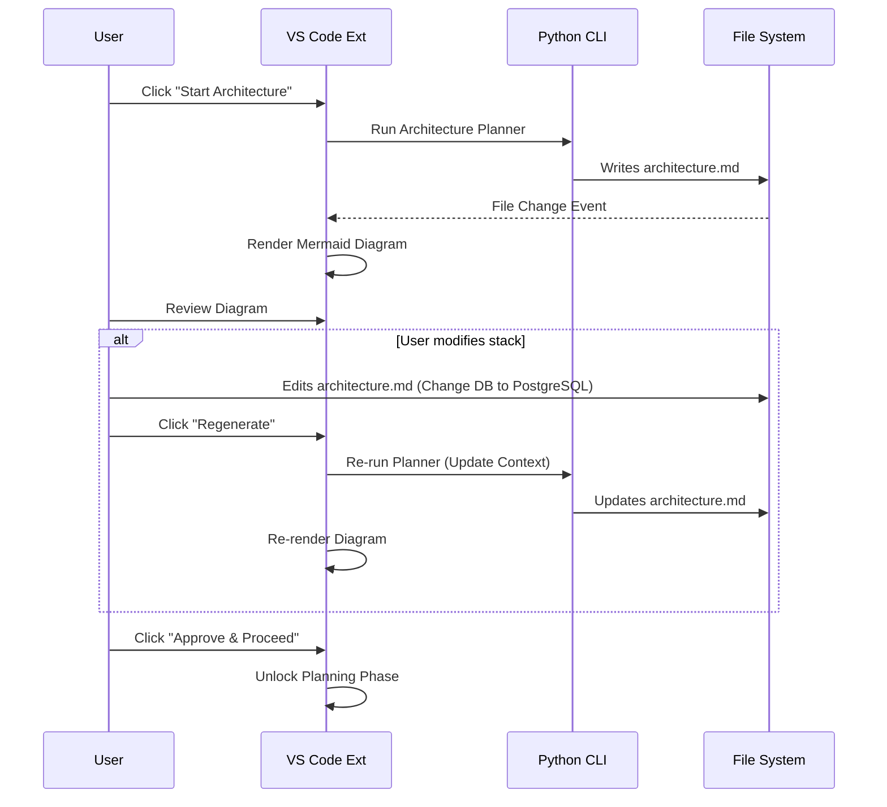
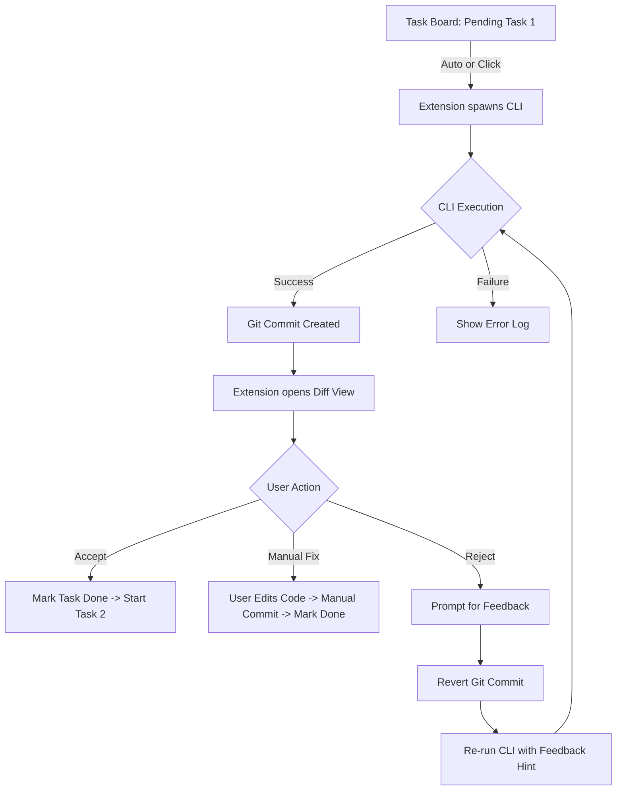

# VS Code Extension Specification: "Code Machine Orchestrator"

**Project Name:** Code Machine Orchestrator (VS Code Extension)
**Target Backend:** Type A Python CLI (as defined in source specs)
**Core Philosophy:** "Human-in-the-Loop" Automation. The AI proposes; the User disposes.

---

## 1. Executive Summary
This extension provides a GUI wrapper around the `Type A Requirements-to-Code` CLI pipeline. Instead of running a single "fire and forget" command, the extension breaks the pipeline into distinct interactive stages. It visualizes the hidden state (Requirements, Architecture, Plan, Tasks) and enforces a "Review & Approve" protocol before any code is finalized, ensuring the user remains the architect while the AI acts as the builder.

## 2. User Experience (UX) Principles
1.  **Transparency:** No hidden CLI operations. All AI decisions (Architecture choices, Plan steps) must be rendered visually for inspection.
2.  **Gating:** The pipeline pauses automatically after critical phases (Requirements, Architecture, Planning) to await user approval.
3.  **Surgical Intervention:** Users can edit the intermediate artifacts (Markdown/JSON) directly in the editor. The system must respect these manual edits when resuming.
4.  **Incremental Trust:** The user can choose to run the build "One Step at a Time" or "Auto-Advance" based on their confidence level.

## 3. Feature Specifications

### 3.1 Activity Bar View: "The Control Center"
A dedicated Sidebar Container with three primary views:
1.  **Project State:** Shows current phase (Concept $\to$ Specs $\to$ Arch $\to$ Plan $\to$ Build).
2.  **Task Board:** Visual representation of `todo.json`.
3.  **Artifacts Linker:** Quick access to `requirements.md`, `architecture.md`, etc.

### 3.2 Phase 1: Prompt & Specification (Augments 2.1)
**Feature:** Interactive Requirement Refinement.
*   **UI:** A Webview form accepting the initial prompt.
*   **Action:** Triggers `cli.py ... --prompt`.
*   **Augmentation:**
    *   Streams the generation of `requirements.md` into a split pane.
    *   **Control Check:** The pipeline pauses. The user sees a "Review Requirements" button.
    *   **UX:** User edits `requirements.md` manually. Only when they click **"Approve & Lock Requirements"** does the system proceed to Architecture.

### 3.3 Phase 2: Architecture Visualization (Augments 2.2)
**Feature:** Live Diagram Rendering.
*   **Action:** Triggers the Architecture Planner.
*   **Augmentation:**
    *   Detects Mermaid diagrams inside `architecture.md` and renders them in a preview panel alongside the text.
    *   **Control Check:** User reviews the Component Map and Tech Stack.
    *   **UX:** If the user changes the tech stack (e.g., "Use PostgreSQL" to "Use SQLite") in the Markdown, they can click **"Regenerate Architecture"** to align the diagrams before moving forward.

### 3.4 Phase 3: The Plan Board (Augments 2.3)
**Feature:** Interactive Task Graph.
*   **Data Source:** Watches `artifacts/todo.json`.
*   **UI:** Renders the JSON not as text, but as a **Tree View** with checkable items.
    *   *Root:* Iterations (e.g., "Iter-1").
    *   *Leaf:* Tasks (e.g., "Task-1: Implement API").
*   **UX Control:**
    *   **Reorder:** Allow drag-and-drop of tasks (updates `todo.json` dependency order).
    *   **Delete/Add:** Context menu to remove a hallucinated task or add a missing one manually.
    *   **Approval:** The build loop cannot start until the user clicks **"Approve Plan"**.

### 3.5 Phase 4: Iterative Build with "Diff-Review" (Augments 2.4)
**Feature:** The "Approve Changes" Loop.
*   **Logic:** Instead of running the full loop, the extension runs the CLI for *one specific task* (requires CLI argument support or step-by-step flag).
*   **The "Diff" UX:**
    *   When the CLI completes a task and commits to git, the extension automatically opens the **Source Control View** filtered to that specific commit/change.
    *   **Side-by-Side Diff:** User sees exactly what code the AI wrote.
    *   **Three Actions:**
        1.  **Accept:** Proceed to next task.
        2.  **Reject & Retry:** Revert changes, open a feedback box ("Why did you reject?"), and re-run the step with the new hint.
        3.  **Manual Fix:** User edits the code manually, commits, and marks the step as "Done" in the UI.

### 3.6 Phase 5: Integrated QA Dashboard (Augments 2.5)
**Feature:** Live Test Reporting.
*   **UI:** A "QA Status" badge on every Task in the Tree View.
*   **Action:** When `tools/test.sh` runs, parse the output.
*   **UX:**
    *   **Green Check:** Task passed QA.
    *   **Red X:** Task failed. Clicking the X opens the `logs/` specific to that failure.
    *   **Auto-Fix Button:** If a task fails, a "Attempt Auto-Fix" button appears, triggering the QA Agent flow explicitly for that task.

## 4. Interface Mockups

### View 1: The Project Planner
```text
[ Sidebar: Code Machine ]
-------------------------
PHASE: ARCHITECTURE
[X] Requirements (Approved)
[>] Architecture (Pending Review)
[ ] Build Plan
-------------------------
> architecture.md (Preview)
  [ Mermaid Diagram Rendered Here ]
  [ Button: Edit Source ]
  [ Button: APPROVE & PROCEED ]
```

### View 2: The Builder View
```text
[ Sidebar: Code Machine ]
-------------------------
ITERATION 1 (In Progress)
v [Completed] Task-1: Setup Project
  > Files: requirements.txt, main.py
  > QA: Passed (Lint/Test)
v [Current] Task-2: Create User Model
  > Status: Waiting for Review
  > [ Button: SHOW DIFF ]
  > [ Button: RETRY ]
  > [ Button: ACCEPT ]
> [Pending] Task-3: API Routes
-------------------------
[ Terminal Output Panel ]
> BuilderAgent: Generating code for Task-2...
```

## 5. Technical Implementation Specs

### 5.1 Extension Settings (`package.json`)
*   `codemachine.cliPath`: Path to the `python cli.py` entry point.
*   `codemachine.autoApprove`: Boolean (Default: False). If True, skips the "Diff Review" step (Low control mode).
*   `codemachine.workingDirectory`: Root folder for project generation.

### 5.2 Command Palette Commands
*   `CodeMachine: New Project`: Launches the Prompt Capture wizard.
*   `CodeMachine: Resume Build`: Re-scans `todo.json` and updates the Tree View.
*   `CodeMachine: Regenerate Step`: Force re-execution of the current task ID.

### 5.3 Data Watching
*   **FileSystemWatcher:** Watch `projects/<name>/artifacts/*.{md,json}`.
*   **Behavior:** When `todo.json` changes on disk (by the CLI), the TreeView must update immediately (Hot-reload).

### 5.4 CLI Integration Wrapper
The extension must spawn the Python process with arguments that allow granular control.
*   *Requirement:* The CLI `build` command needs to support a `--step <id>` or `--pause-after-step` flag.
*   *Wrapper Logic:*
    ```typescript
    async function runStep(taskId: string) {
        // 1. Visual indication: Spinner on Task ID
        // 2. Spawn CLI: python cli.py run --step taskId
        // 3. Await exit code
        // 4. If success -> Trigger Git Diff View
        // 5. If fail -> Show Error Log
    }
    ```

## 6. Non-Functional Requirements (Extension)
1.  **Responsiveness:** The UI must never freeze while the Python CLI is "thinking." All CLI operations must run in async background workers.
2.  **State Persistence:** If VS Code is closed and reopened, the extension must read the `artifacts/` folder to restore the exact state of the progress bar.
3.  **Editor Neutrality:** The extension should not force specific linters or themes, but it should utilize the user's configured Diff Editor.

## 7. Acceptance Criteria (UX Focused)
1.  **The "Hands-off" Test:** A user can generate a full project by clicking "Approve" repeatedly without typing code, but *must* click approve (verifying control).
2.  **The "Intervention" Test:** A user can pause the plan, delete a task from the JSON tree UI, and the subsequent build ignores that task.
3.  **The "Correction" Test:** When the CLI produces a file, the user can reject it, type a specific complaint ("You forgot error handling"), and the CLI retries that specific file generation.

---

# Functional Requirements Document (FRD)
**Project:** Code Machine Orchestrator (VS Code Extension)
**Version:** 1.0
**Date:** November 18, 2025
**Status:** Draft

---

## 1. Introduction & Executive Summary

### 1.1 Project Purpose
The **Code Machine Orchestrator** is a Visual Studio Code extension designed to act as an interactive Graphical User Interface (GUI) for the "Type A Requirements-to-Code" Python CLI pipeline.

The primary problem this tool solves is the lack of transparency and control in "black-box" AI code generation. Existing tools often execute end-to-end without user intervention. This extension enforces a "Human-in-the-Loop" philosophy, breaking the software generation process into distinct, reviewable stages (Specifications, Architecture, Planning, and Building). It ensures the user remains the Architect while the AI acts as the Builder.

### 1.2 Document Scope
This document outlines the functional and non-functional requirements for the VS Code Extension client. It defines the user interface, the interaction logic with the underlying Python CLI, state management, and the workflow for reviewing and approving AI-generated artifacts. The actual logic of the Python CLI generation engine is treated as an external dependency, though its integration points are defined here.

---

## 2. User Roles & Personas

| Role | Description |
| :--- | :--- |
| **The Architect / Developer** | The primary user. A software developer who wants to accelerate project bootstrapping. They are technically proficient but seek to offload boilerplate and implementation details to the AI. They require granular control over architectural decisions and code quality. |
| **The Auditor** | A secondary mode of the Developer, focusing on reviewing the "Plan" and "Diffs" to ensure the AI is not introducing security vulnerabilities or hallucinations before code is committed. |

---

## 3. User Stories

| ID | User Story |
| :--- | :--- |
| **US-01** | **As an** Architect, **I want to** enter a natural language description of my app, **so that** the system can draft formal requirements for me to review. |
| **US-02** | **As an** Architect, **I want to** manually edit the generated `requirements.md` file, **so that** I can correct the AI's understanding before it attempts to design the system. |
| **US-03** | **As an** Architect, **I want to** see a visual rendering of the system architecture (Mermaid diagrams), **so that** I can verify the component relationships and tech stack. |
| **US-04** | **As a** Developer, **I want to** view the build plan as an interactive tree rather than a raw JSON file, **so that** I can visualize dependencies and progress. |
| **US-05** | **As a** Developer, **I want to** reorder, delete, or add tasks to the plan manually, **so that** I can steer the build process if the AI misses a step. |
| **US-06** | **As a** Reviewer, **I want to** see a side-by-side diff of the code generated for a specific task, **so that** I can approve or reject it before moving to the next task. |
| **US-07** | **As a** Reviewer, **I want to** reject a specific code change with a feedback comment, **so that** the AI can retry the task with my guidance. |
| **US-08** | **As a** Developer, **I want** the system to auto-pause after every critical phase, **so that** the AI never runs away with the project without my permission. |

---

## 4. Functional Requirements (FRs)

### 4.1. UI Shell & Navigation ("The Control Center")
*   **FR-001:** The extension must contribute a dedicated Activity Bar Icon and Side Bar Container titled "Code Machine".
*   **FR-002:** The Side Bar must contain three persistent views:
    1.  **Project State:** Indicators for current phase (Specs, Arch, Plan, Build).
    2.  **Task Board:** A tree view of the execution plan.
    3.  **Artifacts Linker:** Quick navigation to `requirements.md`, `architecture.md`, and `plan.md`.
*   **FR-003:** The UI must persist state across VS Code sessions by reading the `projects/<name>/artifacts/` directory on startup.

### 4.2. Phase 1: Specification & Prompting
*   **FR-004:** The extension must provide a "New Project" wizard accepting a Project Name and Initial Prompt.
*   **FR-005:** Upon submission, the system must trigger the CLI command `cli.py ... --prompt`.
*   **FR-006:** The system must display `requirements.md` in a split-pane editor immediately upon generation.
*   **FR-007:** The pipeline must enter a "Gated State" preventing progress until the user clicks an **"Approve & Lock Requirements"** button.

### 4.3. Phase 2: Architecture Visualization
*   **FR-008:** The system must detect Mermaid diagrams within `architecture.md` and render them visually in a dedicated preview panel.
*   **FR-009:** The system must provide a **"Regenerate Architecture"** button that re-triggers the planner if the user manually edits the architecture markdown file.
*   **FR-010:** The pipeline must require an explicit **"Approve & Proceed"** action from the user to transition from Architecture to Planning.

### 4.4. Phase 3: Interactive Planning
*   **FR-011:** The extension must watch `artifacts/todo.json` for changes and hot-reload the "Task Board" Tree View.
*   **FR-012:** The Task Board must visualize `iteration_id` as parent nodes and `task_id` as leaf nodes.
*   **FR-013:** Users must be able to drag-and-drop tasks within the Tree View; the extension must write these order changes back to `todo.json`.
*   **FR-014:** Users must be able to right-click a task to "Delete" or "Add New Task"; these actions must modify the underlying JSON.
*   **FR-015:** The build loop must be disabled until the user clicks **"Approve Plan"**.

### 4.5. Phase 4: Iterative Build & Diff Review
*   **FR-016:** The extension must execute the CLI in a granular mode (e.g., `--step <id>`) rather than a continuous loop.
*   **FR-017:** **Diff View:** Upon task completion, the extension must automatically open the VS Code Source Control (Git) view filtered to the latest commit.
*   **FR-018:** The UI must present three actions for the current "Pending Review" task:
    1.  **Accept:** Marks task complete, triggers the next step.
    2.  **Reject & Retry:** Reverts the git commit, prompts the user for text feedback, and re-runs the CLI step.
    3.  **Manual Fix:** Allows user to edit code, commit manually, and mark the step as "Done".

### 4.6. Phase 5: Integrated QA
*   **FR-019:** The Task Board must display status badges on tasks: Green Check (Passed), Red X (Failed), Spinner (Running).
*   **FR-020:** If a task fails QA (based on CLI output parsing), an **"Attempt Auto-Fix"** button must appear.
*   **FR-021:** Clicking a "Red X" badge must open the specific log file associated with that failure.

### 4.7. Settings & Configuration
*   **FR-022:** Users must be able to configure the path to the Python CLI executable via `codemachine.cliPath`.
*   **FR-023:** Users must be able to toggle `codemachine.autoApprove` (default: `false`). If true, the Diff Review phase is skipped (Low Control Mode).

---

## 5. Non-Functional Requirements (NFRs)

### 5.1. Performance & Responsiveness
*   **NFR-001:** The extension UI must remain responsive at all times. All CLI operations (which may take seconds or minutes) must run in asynchronous background workers.
*   **NFR-002:** Visual updates to the Task Board (Tree View) must occur within 500ms of the `todo.json` file changing on disk.

### 5.2. Reliability & State Management
*   **NFR-003:** The system must be **Idempotent**. Rerunning a command or restarting the editor should strictly resume from the last known state recorded in the `artifacts/` directory.
*   **NFR-004:** Git operations (commits/reverts) must be atomic per task to ensure the "Reject & Retry" feature functions correctly without corrupting the history.

### 5.3. Usability
*   **NFR-005:** The extension must utilize native VS Code UI components (Webviews, TreeViews, Output Channels) to feel like a native part of the editor, not a separate app.
*   **NFR-006:** Error messages from the CLI must be surfaced in a user-friendly "toast" notification, with full details available in an Output Channel.

### 5.4. Compatibility
*   **NFR-007:** The extension must support the user's configured Diff Editor and Theme settings.

---

## 6. System Workflows

### 6.1. Workflow: The Approval Gate (Architecture Phase)
This flow demonstrates the "Human-in-the-Loop" requirement where the user modifies the AI's proposal before proceeding.



### 6.2. Workflow: The Build & Review Loop
This flow details the granular execution of a single task with the diff/review capability.



---

## 7. Ambiguities / Items for Clarification

| ID | Ambiguity | Question for Stakeholders |
| :--- | :--- | :--- |
| **AMB-01** | **CLI Communication Protocol** | The specs mention spawning `python cli.py`. Does the CLI support a machine-readable output mode (e.g., `--json`) for status updates, or must the extension parse raw stdout text logs? |
| **AMB-02** | **QA Integration Details** | The specs mention "Failures create tickets fed to QA agent." Does the CLI handle this internal looping automatically, or does the Extension need to orchestrate the "Ticket -> QA Agent" handoff explicitly? |
| **AMB-03** | **"Retry" Context** | When a user selects "Reject & Retry" and provides feedback, how is that feedback passed to the CLI? Does the CLI accept a `--feedback` string argument for specific steps? |
| **AMB-04** | **Manual Edits to JSON** | If a user manually adds a task to `todo.json` via the UI, how does the system generate the `task_id`? Does the extension generate it, or does it ask the CLI to normalize the file? |

---

## 8. Assumptions
1.  **Environment:** The user has a functioning Python environment with the `Type A` CLI dependencies installed and available in the system PATH (or configured via settings).
2.  **Git Initialization:** The project folder is initialized as a Git repository (the CLI likely handles this in step 1, but the extension relies on it for the Diff View).
3.  **File Locking:** The user will not modify `todo.json` externally (outside VS Code) while the extension is actively building, or if they do, they accept potential race conditions.
4.  **CLI Capability:** The underlying CLI supports (or will be updated to support) granular execution flags like `--step <id>` and `--pause-after-step`.

---

## 9. Out of Scope
1.  **CLI Logic Implementation:** This project covers only the VS Code Extension. Enhancements to the core logic of the `Type A` Python scripts are out of scope unless they are strictly required interfaces for the extension.
2.  **Multi-User Collaboration:** No real-time collaboration features (e.g., Live Share support) are planned for V1.
3.  **Non-Python Project Generation:** The extension is currently hardcoded to interface with the specific `project_types/project_a.py` pipeline.
4.  **Integrated Terminal Management:** While the extension may show logs, full terminal emulation for running arbitrary shell commands outside the defined pipeline is not a core feature.